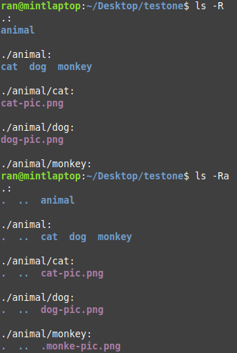
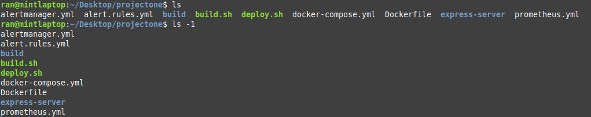
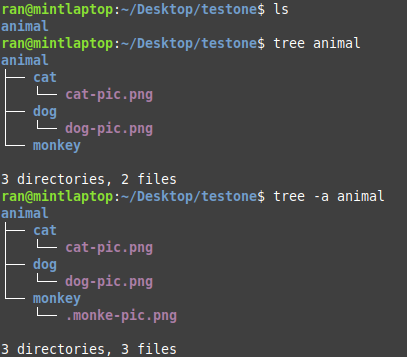
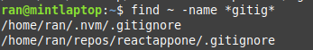

### list recursively
```
ls -R
```

#### ls -R vs ls -Ra


.monke-pic.png is a hidden file

### list by size
```
ls -S

```
### list by reversed order
```
ls -r
```

### list by reversed size order
```
ls -rS
```

### list by last modified time
```
ls -t
```

### list vertically
```
ls -1
```

#### ls vs ls -1



---
### view folder structure
```
tree
```

#### tree vs tree -a

---
### show first ten lines of a file
```
head
```
### show first n number of lines of a file
```
head -n5 filename
```
### show last ten lines of a file
```
tail
```
### show last n number of lines of a file
```
tail -n5 filename
```
### search for a file
```
find /path/to/ -name filename
```
### search for a file and remove errors
```
find /path/to/ -name filename 2>/dev/null
```
### search for all the `.sh` files in home directory
```
find ~ -name *.sh 2>/dev/null
```
### search for files with gitig in its name
```
find ~ -name *gitig* 2>/dev/null
```
#### find /path/to *gitig* 2>/dev/null


